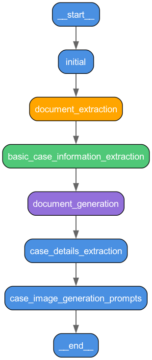

# Mediation Simulator

Mediation Simulator helps develop your mediation skills, powered by NVIDIA Agent Intelligence Toolkit. This project is my submission for the [NVIDIA Agent Intelligence Toolkit Hackathon](https://developer.nvidia.com/agentiq-hackathon).

Mediation is a process where two parties in a dispute come together to resolve their differences. It is a process that is often used in business disputes, but it can be used in other disputes as well. This project was modeled after academic mediation competitions for law school students. The goal of these competitions is to simulate a mediation process and to help law students develop their mediation skills. These competitions use fictional case information and the students assume either the role or the requesting party or the role of the responding party.

In Mediation Simulator, the entire process of mediation is performed by LLMs. There are four main components:

- **Case generation**: case facts and related documents are generated by a series of LLM calls
- **Indexing documents**: documents are indexed in a vector store for retrieval during mediation
- **Simulating mediation**: a mediation is simulated by a series of LLM calls
- **Mediation viewer**: a viewer is used to view the mediation dialog in the web browser

The case generation component is used to generate a case with a fictional dispute between two parties. The documents for each case are indexed and the parties are able to retrieve relevant documents during mediation. The mediation simulator is used to simulate a mediation process and the mediation viewer is used to view the mediation dialog.


## Getting Started

This project requires Python 3.11 or 3.12 and `uv`, it has been tested on MacOS and Linux. Windows is currently not supported.

- Milvus vector store for indexing case documents
- Phoenix for telemetry and tracing
- An NVIDIA API key or a local LLM supporting the OpenAI API and tool calling

## Set up Milvus with docker compose

Milvus is used for indexing case documents and for parties to retrieve relevant documents during mediation.

```
docker compose -f docker-compose.milvus.yml up
```

## Set up Phoenix with docker compose

Phoenix is used for telemetry and tracing.

```
docker compose -f docker-compose.phoenix.yml up
```

The URL for Phoenix is `http://localhost:6006`, this is used in the Agent Intelligence Toolkit configuration files.

## Image generation and TTS

Flux and Dia are used for image and voice generation but they are not required for the project to run.

## NVIDIA Agent Intelligence Toolkit

NVIDIA Agent Intelligence Toolkit code is located in [aiq/](aiq/). See the [README](aiq/README.md) in this directory for detailed instructions on how to set up an environment and install dependencies.

## Case Generation

Case generation runs the following workflow:



Generating a case is done by running the following command:

```bash
cd aiq
aiq run --config_file configs/case-generation.yml --input ""
```

The output from this workflow will include a case ID:

```
Workflow Result:
['qbsknaqs']
```

You can review the case information in the directory `aiq/data/{case_id}/`. You will find the following files:

- initial_case_description.md
- case_generation_state.yaml
- documents/

## Indexing the documents

To index documents for all cases, run the following command from the `aiq` directory with the virtual environment activated:

```bash
python index.py
```

## Simulating Mediation for a Case

Simulating mediation for a case is done by running the following command from the `aiq` directory with the virtual environment activated:

```
aiq run --config_file configs/mediation.yml --input "{case_id}"
```

The mediation workflow is a LangGraph graph that has four main components:

- Clerk
- Mediator
- Requesting Party
- Responding Party

The clerk is responsible for determining the flow of conversation. It has some hardcoded rules that define the main stages of mediation, and within these phases LLM calls are used by the clerk agent to determine the next speaker.

The mediator, requesting party and responding party engage in a conversation that is guided by their prompts. There are system prompts for each speaker for each phase of mediation. There is also a custom function used by each speaker for each phase of mediation that defines a dynamic prompt that brings in case information and a recent summary of the conversation.


## Mediation Simulator Viewer

You can view the results of a mediation by running the following command from the root of the project:

```
python3 -m http.server 8083
```

Then visit [http://[::]:8083/?case_id={case_id}](http://[::]:8083/?case_id={case_id}) to view mediation dialog produced by the workflow.

## Image Generation with Flux

Set up the NVIDIA Flux NIM following instructions [here](https://build.nvidia.com/black-forest-labs/flux_1-dev/deploy). Then run the following command from the root of the project:

```
python flux/main.py
```


## Generate all_cases.yml for website

```
python aiq/generate_case_list_data.py
```

## Generate audio for voice prompts

Dia was used to generate audio for voice prompts. Set up the Dia Gradio server following instructions [here](https://github.com/nari-labs/dia). Then run the following command from the root of the project.

Set your custom prompts in the `dia/main.py` file and also adjust the URL for the Gradio server.

```
python dia/main.py
```